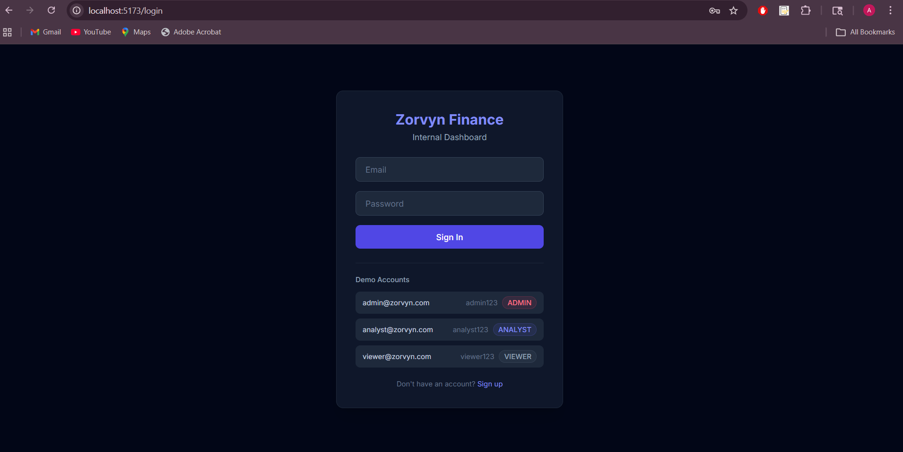
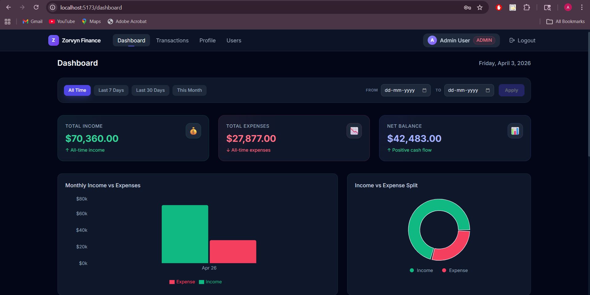
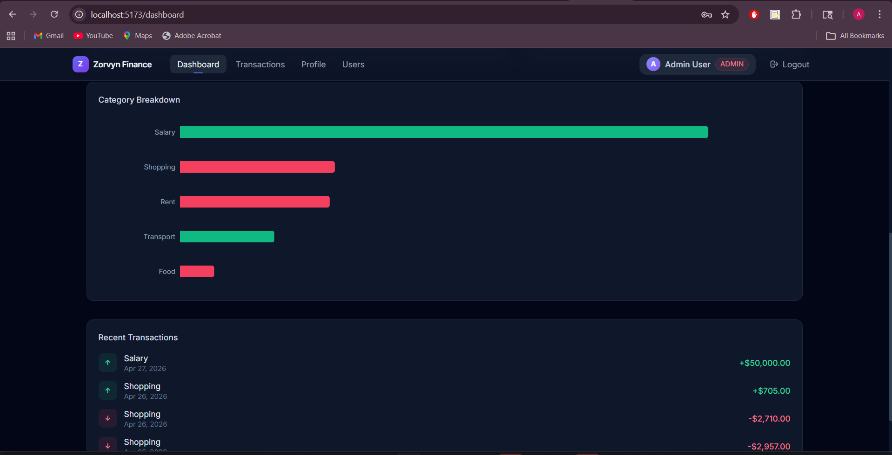
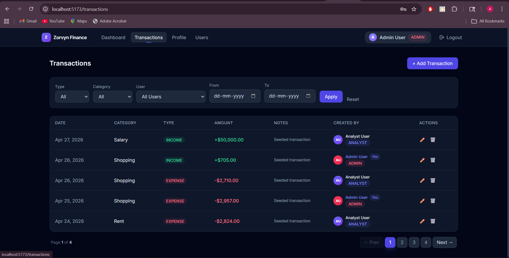
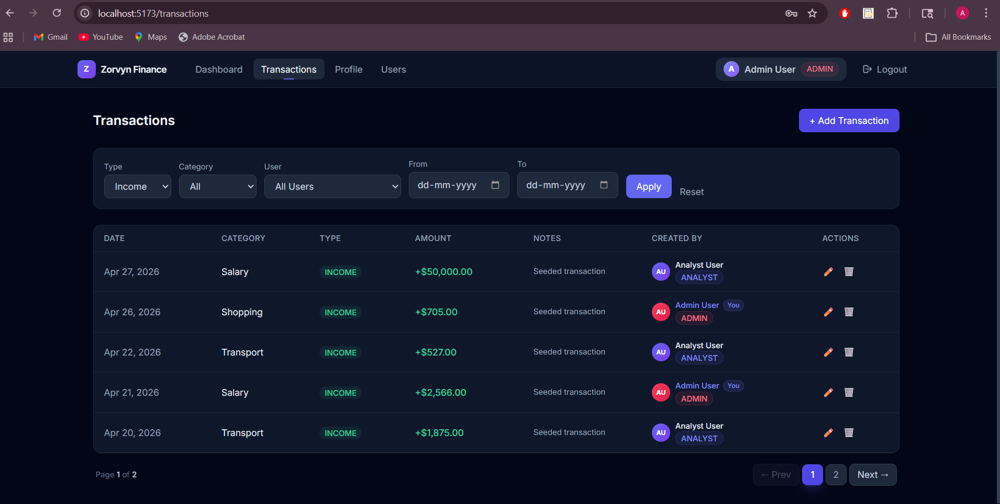
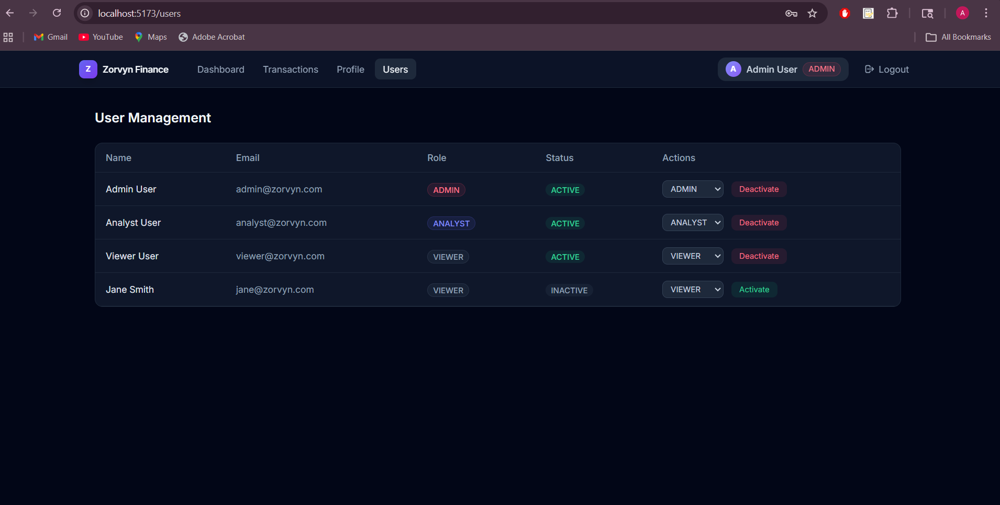

# Zorvyn Finance Dashboard Backend

This repository focuses on the backend system of the Zorvyn Finance Dashboard, with a working frontend included for demonstration and testing purposes.

The system is designed to demonstrate backend architecture, role-based access control, data modeling, and API design for a multi-user financial application.

It supports different user roles with controlled access to financial data and provides aggregated insights for dashboard consumption.

## Features

- User authentication using JWT
- Role-based access control (Viewer, Analyst, Admin)
- Financial transaction management (CRUD operations)
- Soft delete for safe data handling
- Filtering by type, category, date, and user
- Dashboard summary APIs
- Category-wise aggregation
- Multi-user data ownership
- Seed script for initial data setup
- Minimal frontend provided to demonstrate backend functionality

## Tech Stack

- Backend: Node.js, Express.js
- Database: MySQL
- ORM: Prisma
- Authentication: JWT
- Frontend (for demo/testing): React (Vite) + Tailwind CSS

## Architecture

The backend follows a layered architecture:

- Routes: Define API endpoints
- Controllers: Handle request/response logic
- Services: Contain business logic
- Prisma Client: Handles database interaction
- Middleware: Authentication and authorization

This separation ensures maintainability and scalability.

## Database Design

The application uses MySQL as the relational database, managed through Prisma ORM.

### Schema Overview

Two main entities:

#### User
Stores authentication and role information.

#### Transaction
Stores financial data linked to a user.

Relationships:
- One user can have multiple transactions
- Each transaction belongs to a single user

Primary keys and foreign key constraints ensure data integrity between users and transactions.

Prisma is used for type-safe queries and schema management.
Schema defined in:
/prisma/schema.prisma

## Role-Based Access Control

The system defines three roles:

### Viewer
- Can access dashboard summary only
- Cannot view or modify transactions

### Analyst
- Can view transactions and dashboard data
- Cannot create, update, or delete transactions

### Admin
- Full access to all features
- Can create, update, delete transactions
- Can view all users' data

Access control is enforced at the middleware level.

## Data Model

### User
- id
- name
- email (unique)
- passwordHash
- role (VIEWER, ANALYST, ADMIN)
- status
- createdAt

### Transaction
- id
- amount
- type (INCOME, EXPENSE)
- category
- date
- notes
- createdBy (User ID)
- isDeleted (soft delete flag)
- createdAt
- updatedAt

Each transaction is linked to a user.

## API Endpoints

### Authentication
POST /api/auth/register  
POST /api/auth/login  

### Transactions
GET /api/transactions  
POST /api/transactions  
PUT /api/transactions/:id  
DELETE /api/transactions/:id  
GET /api/transactions/:id  

### Filters
GET /api/transactions?type=EXPENSE  
GET /api/transactions?category=Food  
GET /api/transactions?startDate=YYYY-MM-DD&endDate=YYYY-MM-DD  
GET /api/transactions?userId=2  

### Dashboard
GET /api/transactions/summary  
GET /api/transactions/summary?startDate=...&endDate=...

## Authentication

The system uses JWT-based authentication.

- Token is issued on login
- Token must be included in Authorization header:
  Authorization: Bearer <token>

The token contains user ID and role, which is used for access control.

## Project Structure

backend/
  src/
    controllers/
    services/
    routes/
    middleware/
    config/
  prisma/
    schema.prisma
    seed.js
  .env
  server.js

## Engineering Decisions

- Used Prisma ORM for clean data access and type safety
- Implemented soft delete instead of hard delete to preserve audit history
- RBAC enforced at middleware level for scalability
- Aggregations handled in service layer instead of raw SQL for clarity
- JWT-based authentication used for stateless sessions

## Setup

1. Clone repository

2. Install dependencies
npm install

3. Configure environment variables (.env)
 Copy `.env.example` to `.env` and update values
4. Run migrations
npx prisma migrate dev

5. Seed database
npx prisma db seed

6. Start server
npm run dev

## Assumptions

- Each transaction belongs to one user
- Viewer role is restricted to dashboard only
- Soft delete is used instead of hard delete
- Admin can view all transactions across users

## Tradeoffs

- Aggregations are handled in application logic instead of database-level queries for simplicity
- No advanced indexing or optimization applied due to scope
- Authentication is simplified (no refresh tokens)

## Edge Cases Handled

- Invalid login credentials
- Unauthorized role access
- Filtering with no results
- Soft-deleted records excluded from queries

## Future Improvements

- Add refresh token-based authentication
- Move aggregations to database level for performance
- Add indexing on date and category fields
- Implement audit logs for transactions
- Add caching (Redis) for dashboard summary
- Add rate limiting for APIs

## Testing

- APIs tested using Postman
- Edge cases validated:
  - Invalid login
  - Unauthorized access
  - Role-based restrictions
- Postman collection included for reference
- Import `zorvyn_finance_collection.json`
- Set environment variable:
  - base_url = http://localhost:5000
- Login once → token auto-saves

All APIs are pre-configured with authentication.

## Screenshots

### Login Page

### Dashboard Overview

### Dashboard Analytics

### Transactions

### Filters Applied

### User Management

## Author Notes

This project was developed as part of a backend-focused assessment to demonstrate:

- Scalable API design
- Role-based access control
- Clean architecture practices
- Real-world financial data handling

Focus was placed on maintainability, clarity, and practical backend engineering decisions.